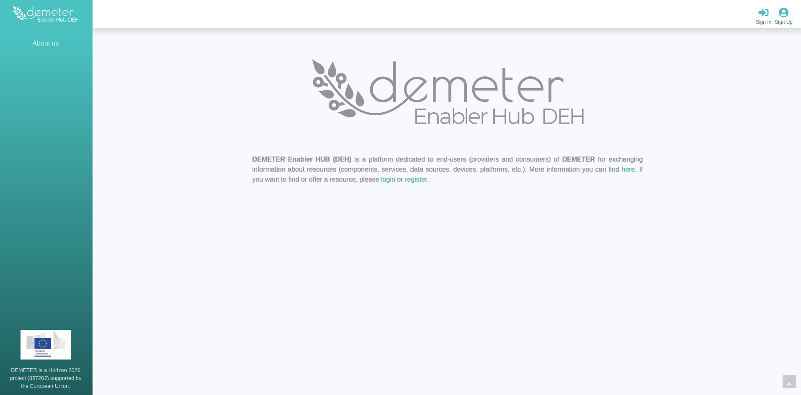
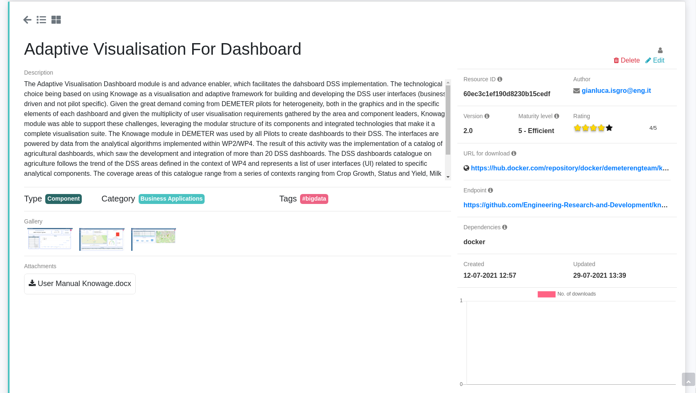
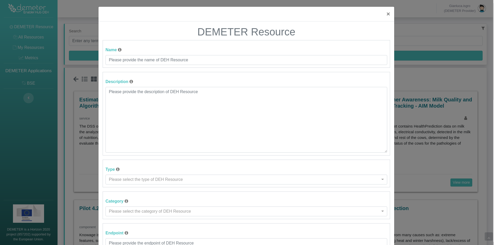
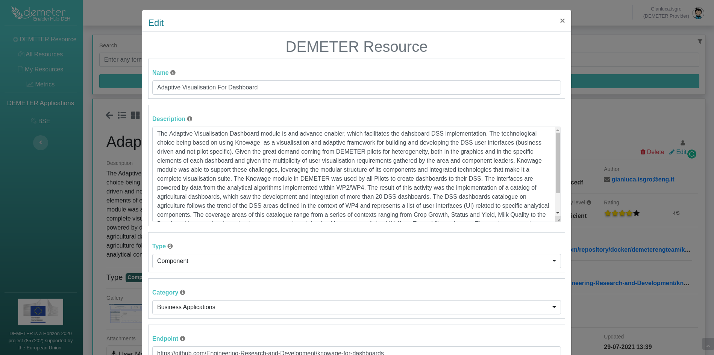
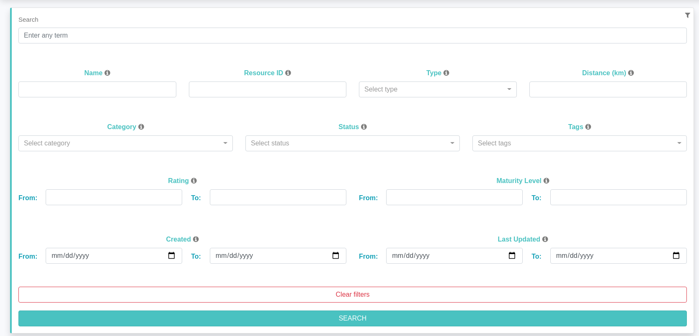
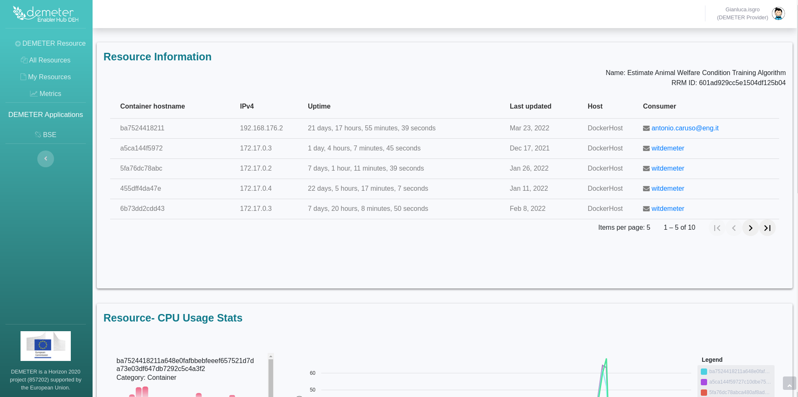
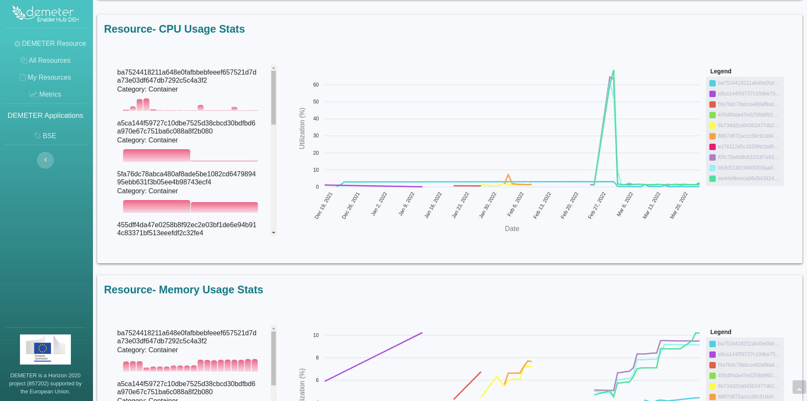

# Demeter DEH Dashboard

 

DEH Dashboard represents the DEH front-end application, which is used by end-users or DEMETER Stakeholders for resource creation, discovery and monitoring consumption. The DEH Resources are represented by a set of entities such as Component, Device, Service, Dataset, Platform which can be added via the DEH Dashboard or RRM APIs. 
DEH Dashboard functional module is in charge of User Interaction & Data Visualisation. It will allow users to log in to DEH, discover, register, and manage DEMETER Enablers, alongside monitoring their consumption.

 

## Table of contents
* [**Screenshots**](#screenshots)
* [**Technologies**](#technologies)
* [**Features**](#features)
* [**Requirements**](#requirements)
* [**Setup**](#setup)
* [**How to use**](#using)
* [**Contributors**](#contributors)
* [**Status**](#status)
* [**Licence**](#licence)

 

## Screenshots

### Home page

### List of resources

### Resource details

### Add new resource

### Update resource

### Filter resource list

### DEH Resources metrics overview

### Metrics for specific DEH Resource

 

## Technologies

 

| Description   | Language      | Version |
| ------------- |:-------------:| -------:|
| [Angular][1]  | JavaScript    | 10.0.2  |
| [Docker][2]   |               | 19.03.8 |

 

[1]: https://angular.io/
[2]: https://docs.docker.com/get-docker/

 

## Features

 

* Resource discovery through advanced search API
* New resources creation and editing
* Resource compatibility checking
* Resource rating visualization
* Resource download visualization
* Resource consumption monitoring

 

## Requirements

* Installed Docker (version >= 18) 
* Installed Docker Compose
* Installed Node.js (version >= 12) - **_only for local development_**

 

## Setup

 

After pulling the source code, go to root folder and follow the next steps:

 

### Run application using docker-compose
------

 
* _Run_ `docker-compose up` _in order to start DYMER services_
* _If you want to run containers in the background run the next command_ `docker-compose up -d`
* _Change_ `DYMER_URL` _in_ `.env` _if you want to run DYMER on a specific port. The default value is_ `DYMER_URL=https://deh-demeter.eng.it/dymer/
`
* _All docker variables related to DEH Dashboard can be changed in_ `.env` _file_

### Local development
------

 

##### Development server

 

* Run `ng serve` for a dev server. Navigate to `http://localhost:4200/`. The app will automatically reload if you change any of the source files.

 

##### Code scaffolding

 

* Run `ng generate component component-name` to generate a new component. You can also use `ng generate directive|pipe|service|class|guard|interface|enum|module`.

 

##### Build

 

* Run `ng build` to build the project. The build artifacts will be stored in the `dist/` directory. Use the `--prod` flag for a production build.

 

##### Running unit tests

 

* Run `ng test` to execute the unit tests via [Karma](https://karma-runner.github.io).

 

##### Running end-to-end tests
* Run `ng e2e` to execute the end-to-end tests via [Protractor](http://www.protractortest.org/).

 

##### Further help

 

* To get more help on the Angular CLI use `ng help` or go check out the [Angular CLI README](https://github.com/angular/angular-cli/blob/master/README.md).

 

## How to use

 

* Open an application in your browser at `localhost:8080/`

 

## Contributors

 

* [Marko Stojanovic](https://github.com/marest94) 
* [Slobodan Paunovic](https://github.com/slobodan82) 

 

## Status
Project is: _in progress_

## Release
V2.0

 

## License
<!--- If you're not sure which open license to use see https://choosealicense.com/--->

